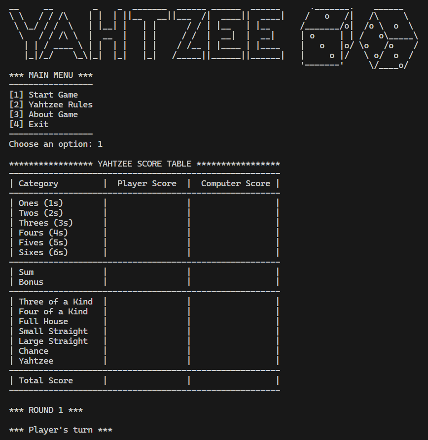

# C-based Yahtzee Game (CLI)



This is a command-line version of the classic Yahtzee dice game, written in C. The game includes a single-player mode against a computer opponent, which follows a strategy for selecting scoring categories. The objective is to score as many points as possible by rolling dice and achieving specific combinations.

---

## Table of Contents
- [Overview](#overview)
- [Game Rules](#game-rules)
- [Installation](#installation)
- [How to Play](#how-to-play)
- [Computer Strategy](#computer-strategy)
- [Challenges](#challenges)
- [Features](#features)
- [Future Improvements](#future-improvements)

---

## Overview

Yahtzee is a dice game where the player rolls five dice up to three times per turn, aiming to achieve specific scoring combinations. Points are awarded based on the achieved combinations, and the player with the highest score wins. This command-line implementation of Yahtzee includes a human player vs. computer player mode, making it fun and challenging!

---

## Game Rules

### Objective
The objective of the game is to get the highest score by rolling five dice and obtaining specific combinations.

### Scoring Categories

#### Upper Section
In the upper section, points are scored based on the sum of each specific number (1s through 6s). If the sum of these scores reaches 63 or more, a bonus of 35 points is awarded.

#### Lower Section
- **Three of a Kind**: Sum of all dice if at least three are the same.
- **Four of a Kind**: Sum of all dice if at least four are the same.
- **Full House**: 25 points for a combination of three of one number and two of another.
- **Small Straight**: 30 points for a sequence of four (1-2-3-4, 2-3-4-5, or 3-4-5-6).
- **Large Straight**: 40 points for a sequence of five (1-2-3-4-5 or 2-3-4-5-6).
- **Chance**: Sum of all dice (useful for any roll).
- **Yahtzee**: 50 points for five of a kind. Additional Yahtzees are worth 100 points each.

---

## Installation

To compile and run the game, ensure you have a C compiler installed. Then, follow these steps:

1. Clone the repository or download the source files.
2. Open a terminal in the project directory.
3. Compile the game using `gcc`:
   ```bash
   gcc -o yahtzee_game yahtzee.c
